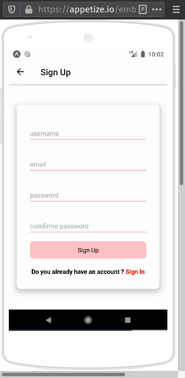

# About project

Image_Share is a [react native](https://reactnative.dev/docs/getting-started) project built using [EXPO Platform](https://docs.expo.io/) , the idea of the project is to take images using the camera created from scratch and customized then upload those pictures and store theme in firebase Store service and every image uploaded it's data will be saved in the firebase real time database what make's those images shared between authenticated users 

# firebase services used for this project

authentication     ==> to authenticate users 
real time database ==> to save images data (URLS)
Storage            ==> to store images


# Project ScreenShots

login screen:


login screen:



Images List screen:


Camera screen:


## Getting Started

First, run :

```
npm install # to install all dependencies
```

then, Starting the development server :

```
expo start
```
## Learn more

to learn more how to create react native app using expo [click here](https://docs.expo.io/get-started/create-a-new-app/)

# import your project to the expo snack
you can start editing this project from your browser using [expo snack](https://snack.expo.io/)

# Sample Snack app

Open the `App.js` file to start writing some code. You can preview the changes directly on your phone or tablet by clicking the **Run** button or use the simulator by clicking **Tap to Play**. When you're done, click **Save** and share the link!

When you're ready to see everything that Expo provides (or if you want to use your own editor) you can **Export** your project and use it with [expo-cli](https://docs.expo.io/versions/latest/introduction/installation.html).

All projects created in Snack are publicly available, so you can easily share the link to this project via link, or embed it on a web page with the **Embed** button.

If you're having problems, you can tweet to us [@expo](https://twitter.com/expo) or ask in our [forums](https://forums.expo.io).

Snack is Open Source. You can find the code on the [GitHub repo](https://github.com/expo/snack-web).
